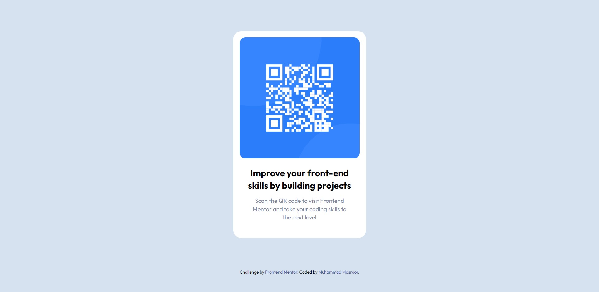

# Frontend Mentor - QR code component solution

This is a solution to the [QR code component challenge on Frontend Mentor](https://www.frontendmentor.io/challenges/qr-code-component-iux_sIO_H). Frontend Mentor challenges help you improve your coding skills by building realistic projects.

### Screenshot

### Links

- Solution URL: [Add solution URL here](https://your-solution-url.com)
- Live Site URL: [Add live site URL here](https://your-live-site-url.com)

### Built with

- Semantic HTML5 markup
- CSS
- SASS

### What I learned

This is the first time I created a project all by myself using my knowledge.

I learened a lot about how to approach a project basically, how to structure my content with HTML and how to plan beforehand my CSS classes and reusable styles.

Nothing special to mention particularly, it's just basic HTML, CSS, and SASS.

### Continued development

I would like to focus more on some advanced CSS although not much CSS & SASS is used in this project.... actually much wasn't needed anyway.

## Author

- Frontend Mentor - [@p-a-r-a-s](https://www.frontendmentor.io/profile/p-a-r-a-s)
